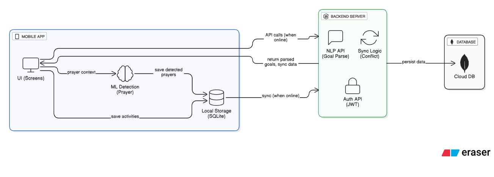

# System Architecture - ZoeTrack

## Table of Contents
1. [Overview](#overview)
2. [Technology Stack](#technology-stack)
3. [System Components](#system-components)
4. [Data Flow](#data-flow)
5. [Technical Feasibility](#technical-feasibility)
6. [Offline-First Architecture](#offline-first-architecture)
7. [Security & Privacy](#security--privacy)
8. [Scalability](#scalability)

---

## Overview

ZoeTrack is architected as a **mobile-first, offline-capable** application built with React Native for cross-platform support (iOS & Android). The system prioritizes local-first operation with eventual consistency sync, ensuring users can track their spiritual growth regardless of network connectivity.

### Architecture Diagram


```
┌─────────────────────────────────────────────────────┐
│                  Mobile App (React Native)          │
│  ┌─────────────┐  ┌──────────────┐  ┌────────────┐ │
│  │   UI Layer  │  │  ML Detection│  │Local Storage│ │
│  │  (Screens)  │  │   (Prayer)   │  │  (SQLite)  │ │
│  └─────────────┘  └──────────────┘  └────────────┘ │
└────────────────────────┬────────────────────────────┘
                         │ API Calls (when online)
                         ↓
┌─────────────────────────────────────────────────────┐
│              Backend Server (Node.js)               │
│  ┌─────────────┐  ┌──────────────┐  ┌────────────┐ │
│  │   NLP API   │  │  Sync Logic  │  │  Auth API  │ │
│  │ (Goal Parse)│  │  (Conflict)  │  │   (JWT)    │ │
│  └─────────────┘  └──────────────┘  └────────────┘ │
└────────────────────────┬────────────────────────────┘
                         │
                         ↓
                  ┌─────────────┐
                  │   MongoDB   │
                  │  (Cloud DB) │
                  └─────────────┘
```

**Key Design Principle**: Local-first with cloud backup (not cloud-first with local cache)

---

## Technology Stack

### Frontend: React Native 0.73+

**What it is**: Cross-platform mobile framework that lets us build native iOS and Android apps with one JavaScript codebase.

**Why we chose it:**
1. **Single Codebase**: Write once, deploy to both iOS and Android simultaneously - cuts development time in half
2. **Native Performance**: Renders actual native components, not webviews - feels like a real iOS/Android app
3. **Rich Ecosystem**: Access to device sensors, background services, local storage - everything needed for prayer detection
4. **Offline Capabilities**: Built-in support for local storage and background tasks

**Key Libraries:**
- **React Native SQLite**: Local database for offline storage
- **TensorFlow Lite React Native**: On-device ML for prayer detection
- **React Navigation**: Screen navigation and routing
- **AsyncStorage**: Simple key-value storage for app settings
- **React Native Push Notifications**: Smart reminder system

---

### Backend: Node.js 20.x with Express.js 4.x

**What it is**: JavaScript runtime for building the server that handles sync, goal parsing, and user authentication.

**Why we chose it:**
1. **JavaScript Everywhere**: Same language as frontend (React Native) - developers can work on both sides easily
2. **Non-Blocking I/O**: Perfect for handling thousands of sync requests simultaneously without slowing down
3. **NPM Ecosystem**: Access to 2+ million packages including NLP libraries for goal parsing

**API Architecture**: RESTful API with JSON payloads

**Key Libraries:**
- **Express.js**: Web framework for API endpoints
- **Compromise.js**: Natural language processing for goal parsing ("I want to pray 30 minutes daily" → structured activity)
- **JWT (jsonwebtoken)**: Secure authentication tokens
- **Mongoose**: MongoDB object modeling
- **Node-cron**: Background jobs for reminder scheduling

---

### Database: MongoDB Atlas (Cloud) + SQLite (Local)

**Cloud Database: MongoDB**

**Why we chose it:**
1. **Flexible Schema**: Spiritual activities vary (prayers, fasting, message listening) - rigid tables would be painful to maintain
2. **JSON-Native**: Data flows naturally from app → server → database without transformation
3. **Horizontal Scaling**: Can add servers as user base grows without code changes

**Data Modeling Approach**: Document-based with embedded subdocuments for activities and notes

**Local Database: SQLite**

**Why we chose it:**
1. **Offline-First**: All data lives locally first, syncs to cloud when available
2. **Zero Configuration**: Built into React Native, no setup needed
3. **Transactional**: Ensures data integrity even if app crashes mid-write

---

### Additional Technologies

- **Authentication**: JWT tokens (stateless, scalable) + bcrypt password hashing (12 salt rounds)
- **ML/AI**: TensorFlow Lite (on-device prayer detection model)
- **Natural Language Processing**: Compromise.js (parses user goals into structured activities)
- **Hosting**: 
  - Backend: Railway (auto-scaling, easy deployment)
  - Database: MongoDB Atlas (managed, free tier for MVP)
  - Mobile: App Store + Google Play Store
- **Version Control**: Git/GitHub
- **API Testing**: Postman

---

## System Components

### 1. Mobile App Layer (React Native)

**Responsibilities:**
- User interface rendering
- Prayer detection (on-device ML)
- Local data storage (SQLite)
- Background sync when online
- Push notification handling

**Key Modules:**

**Goal Input Parser (Frontend)**
- Captures natural language input
- Sends to backend NLP API
- Displays parsed activities for user confirmation

**Prayer Detection Engine (Local ML)**
- Monitors phone sensors (accelerometer, microphone, usage patterns)
- Runs TensorFlow Lite model on-device (no data sent to server)
- Triggers prompt: "It sounds like you are praying, should we start tracking it?"
- Tracks duration and saves to SQLite

**Activity Tracker**
- Color-codes completion (red/yellow/blue/green based on percentage)
- Manual toggle for non-prayer activities (joy expression, worship)
- Weekly summary views

**Note Organization System**
- Hierarchical folder structure (Year → Month → Category)
- Auto-detects action plans in notes
- Prompts to create activities from detected plans

**Smart Reminder System**
- Learns user's phone usage patterns (when they're most active)
- Sends reminders on user-selected days
- Tracks 3-attempt system for message listening goals

---

### 2. Backend Server Layer (Node.js)

**Responsibilities:**
- Natural language processing (goal parsing)
- User authentication
- Sync conflict resolution
- Data persistence to MongoDB
- Reminder scheduling

**Key Modules:**

**NLP Goal Parser API**
- Endpoint: `POST /api/goals/parse`
- Uses Compromise.js to extract:
  - Activities (pray, listen, express joy)
  - Durations (30 minutes, 5 minutes)
  - Recurrence (daily, weekly)
  - References (Bible verses, pastor names)
- Returns structured JSON for app to create activities

**Sync Engine**
- Endpoint: `POST /api/sync`
- Receives local changes from app
- Resolves conflicts (last-write-wins by timestamp)
- Returns updated data
- Batches updates for efficiency

**Authentication API**
- Endpoints: `POST /api/auth/register`, `POST /api/auth/login`
- JWT tokens with 7-day expiration
- Password hashing with bcrypt

**Reminder Scheduler**
- Background cron jobs
- Sends push notifications at optimal times
- Tracks 3-attempt reminder cycle for message listening

---

### 3. Data Layer (MongoDB + SQLite)

**Local Storage (SQLite):**
- Primary data store for offline operation
- Tables: Users, Activities, Notes, Completions
- Sync queue: Tracks pending changes to upload

**Cloud Storage (MongoDB):**
- Backup and sync destination
- Collections: users, activities, notes
- Indexed by userId for fast queries

---

## Data Flow

### User Flow 1: Natural Language Goal Setup

**[ADD SEQUENCE DIAGRAM HERE - Show this flow:]**
```
User → App → Backend → Database

1. User writes: "I want to pray 30 minutes daily for my family"
2. App sends text → Backend NLP API
3. Backend parses:
   {
     type: "prayer",
     goal: 30,
     unit: "minutes",
     recurrence: "daily",
     subject: "family"
   }
4. Backend returns structured data → App
5. App displays: "Create daily prayer activity: 30 min for family?"
6. User confirms
7. App saves to SQLite locally
8. App syncs to MongoDB (when online)
```

---

### User Flow 2: Automatic Prayer Detection & Tracking
```
Phone Sensors → ML Model → App UI → Local DB → Cloud Sync

1. User starts praying (phone stationary, audio patterns detected)
2. TensorFlow Lite model (running locally) detects prayer context
3. App triggers prompt: "It sounds like you are praying, track it?"
4. User taps "Yes" (or auto-starts after 30 seconds)
5. Timer starts counting
6. User finishes praying
7. Duration calculated (e.g., 25 minutes)
8. Color-code calculated:
   - Goal: 30 minutes
   - Actual: 25 minutes
   - Percentage: 83%
   - Color: Blue (75-94%)
9. Saved to SQLite with blue checkmark
10. Synced to MongoDB when online
```

**Defense**: "Prayer detection runs entirely on-device. No audio is ever uploaded. Privacy is 100% guaranteed."

---

### User Flow 3: Smart Message Listening Reminders
```
1. User sets goal: "1 message/week by Pastor X"
2. User picks reminder days: Monday, Wednesday, Friday
3. App learns user is most active at 8 PM (from usage patterns)

Monday:
4. 8 PM: Push notification → "Time to listen to your weekly message?"
5. 10 PM: App asks → "Did you listen to the message today?"
6. User responds "No"
7. Activity stays incomplete

Wednesday:
8. 8 PM: Reminder sent again
9. 10 PM: User responds "Yes"
10. Activity marked complete ✅ for the week
11. No more reminders until next week

If user says "No" all 3 times (Monday, Wednesday, Friday):
12. Friday 10 PM: Activity marked ❌ for the week
13. Monday next week: Cycle resets
```

---

### User Flow 4: Offline-First Sync
```
Offline Mode:
1. User prays → Saved to SQLite
2. User writes note → Saved to SQLite
3. Changes queued in sync_queue table

Online Mode:
4. App detects WiFi/data connection
5. Sync queue uploads batched changes → Backend
6. Backend checks for conflicts:
   - If no conflict → Save to MongoDB
   - If conflict → Last-write-wins (timestamp comparison)
7. Backend returns updated data → App
8. App updates SQLite with latest
9. Sync queue cleared
```
---


## Technical Feasibility

### Why This Architecture Works

**1. Proven Technology Stack**

Every technology is battle-tested:
- **React Native**: Used by Meta, Microsoft, Tesla
- **Node.js**: Powers LinkedIn, Netflix, Uber
- **MongoDB**: Used by Adobe, eBay, Google
- **TensorFlow Lite**: Google's production ML framework

---

**2. Achievable Scope for MVP**

Core features are technically straightforward:
- Natural language parsing: Use Compromise.js library (pre-built)
- Prayer detection: Train simple TensorFlow Lite model on prayer patterns
- Offline sync: Standard React Native pattern with SQLite
- Color-coded tracking: Simple percentage calculation

**Timeline**: 8-12 weeks for MVP with 1-2 developers

---

**3. On-Device Privacy**

Prayer detection runs entirely locally:
- TensorFlow Lite model lives on phone
- No audio/sensor data leaves device
- Only duration and timestamps sync to cloud

---

**4. Scalability Built In**

- MongoDB can scale horizontally (add more servers)
- Node.js handles thousands of concurrent syncs
- SQLite handles all local operations (no server dependency)
- Push notifications via Firebase (handles billions/day)

---

### Technical Challenges & Solutions

| Challenge | Solution |
|-----------|----------|
| **Prayer detection accuracy** | Train ML model on diverse prayer patterns; allow manual override if detection fails | 
| **Sync conflicts (multiple devices)** | Last-write-wins based on timestamp; rare conflicts acceptable for spiritual tracking | 
| **Battery drain from detection** | Run detection only during likely prayer times (morning/evening); use low-power sensors | 
| **NLP parsing accuracy** | Start with common patterns; improve with user feedback; allow manual activity creation fallback | 
| **Cross-platform consistency** | React Native renders native components; extensive testing on both platforms |

---
## Offline-First Architecture

### Why Offline-First?

**Problem**: Users pray in locations without internet (church, quiet rooms, commutes)

**Solution**: All core features work without network:
- Prayer detection (local ML)
- Activity tracking (SQLite)
- Note-taking (SQLite)
- Reminder notifications (local scheduling)

Only sync requires internet, and it happens automatically in background.

### Implementation Pattern
```javascript
// Pseudo-code for offline-first pattern

async function saveActivity(activity) {
  // 1. Always save locally first
  await SQLite.insert('activities', activity);
  
  // 2. Add to sync queue
  await SQLite.insert('sync_queue', {
    action: 'CREATE',
    table: 'activities',
    data: activity,
    timestamp: Date.now()
  });
  
  // 3. Attempt sync if online (non-blocking)
  if (isOnline()) {
    syncInBackground(); // Runs separately, doesn't block UI
  }
  
  // User sees saved activity immediately, sync happens later
}
```

---

## Security & Privacy

### 1. Data Protection

**Passwords:**
- Never stored in plain text
- Hashed with bcrypt (12 salt rounds)
- Salted before hashing (unique per user)

**Prayer Audio:**
- Never recorded or uploaded
- ML model processes in real-time, no storage
- Only duration and timestamp saved

**Notes:**
- Encrypted in transit (HTTPS/TLS)
- Stored securely in MongoDB (access-controlled)
- Local SQLite encrypted with device encryption


---

### 2. Authentication & Authorization

**JWT Tokens:**
- Signed with secret key (256-bit)
- 7-day expiration (re-login required)
- Stored in secure mobile storage (Keychain/Keystore)

**API Security:**
- All endpoints require valid JWT
- Rate limiting (100 requests/minute per user)
- Input validation on all data

---

### 3. GDPR/Privacy Compliance

- User data export available (JSON format)
- Account deletion permanently removes all data
- No third-party analytics (privacy-first)
- Clear privacy policy (spiritual data is sacred)

---

## Scalability

### Current MVP Capacity

**Target**: 1,000-10,000 users
**Expected Load**:
- 10,000 users × 3 prayers/day = 30,000 prayer logs/day
- 10,000 users × 1 sync/hour = 240,000 syncs/day
- Note creation: ~50,000/day

**Why it works**: MongoDB Atlas free tier handles 512MB data, Railway free tier handles 500k requests/month. We're well within limits.

---

### Growth Strategy (10K → 100K users)

**Database:**
- Upgrade MongoDB Atlas tier 
- Add database indexes on userId, date fields
- Implement read replicas for faster queries

**Backend:**
- Scale Railway dynos (horizontal scaling)
- Add Redis caching for frequent queries
- Implement CDN for static assets

**Mobile App:**
- No changes needed (offline-first handles it)
- Push notifications via Firebase (handles billions)

---

## Development Roadmap

### Phase 1: MVP (Months 1-3)
**Core Features:**
- ✅ Natural language goal input
- ✅ Automatic prayer detection (basic ML model)
- ✅ Color-coded activity tracking (4 colors)
- ✅ Hierarchical note organization
- ✅ Smart message reminders (3-attempt system)
- ✅ Offline-first sync
- ✅ iOS + Android launch

**Deliverable**: Functional app on both app stores, free for all users

---

**Phase 2 and Phase 3 plans to be communicated**

---

## Conclusion

ZoeTrack's architecture is built on three core principles:

1. **Offline-First**: Users never depend on internet for core functionality
2. **Privacy-First**: Prayer data never leaves the device
3. **Grace-First**: Technology serves spiritual growth, not legalism

**Technical Strengths:**
- ✅ Proven, scalable tech stack (React Native, Node.js, MongoDB)
- ✅ Innovative prayer detection (first-of-its-kind feature)
- ✅ Realistic MVP scope (achievable in 8-12 weeks)
- ✅ Clear path to 100K+ users without rewrite
- ✅ Privacy-focused design (no audio storage, local ML)
- ✅ Grace-focused UX (color-coded, not pass/fail)

**Why This Will Work:**

Every technical decision is justified by real user needs:
- Offline-first → Users pray without WiFi
- Prayer detection → Manual tracking gets forgotten
- Color-coded system → Legalistic tracking discourages users
- Natural language input → Forms feel like homework

**Bottom Line**: This isn't experimental tech. It's proven tools combined in a novel way to solve a real problem: helping Christians maintain consistent personal time with God.

---
 
**Version**: 1.0  
**Author**: [Busayo F]  

